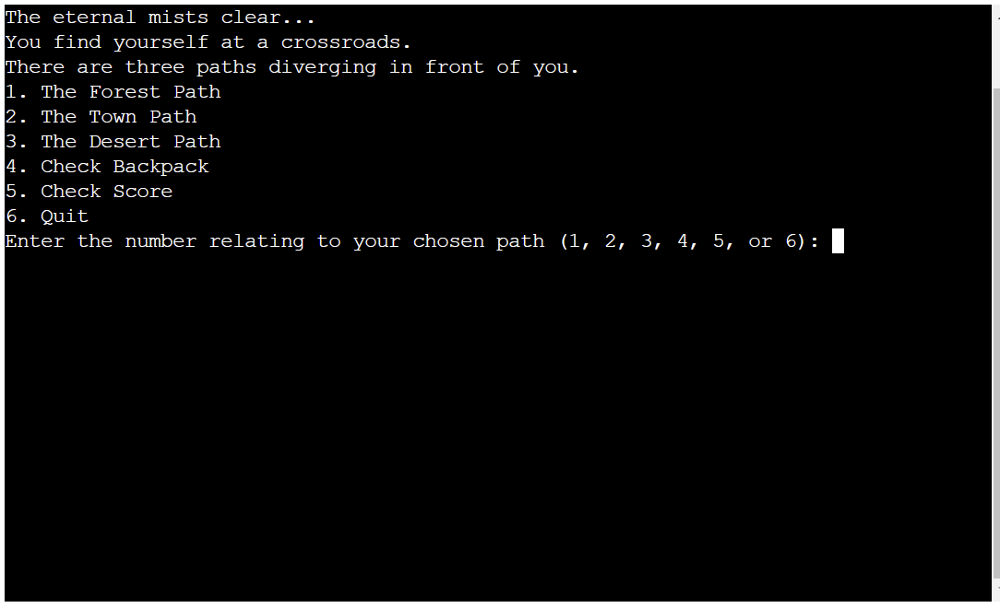
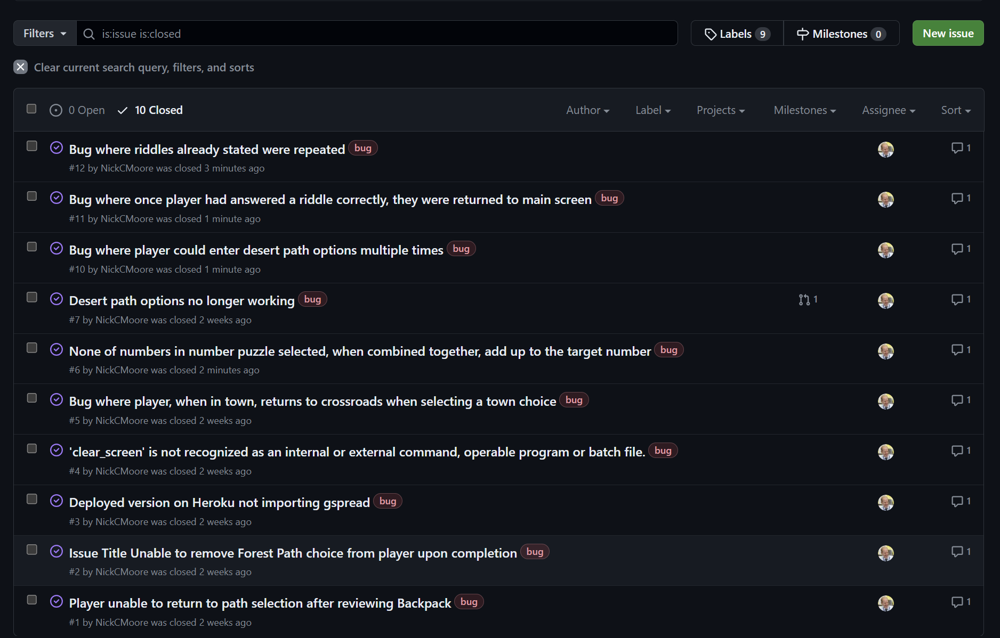

# **_Eldoria Text Adventure_**

Eldoria Text Adventure is an interactive and mythical journey where the player takes on the role of an adventurer exploring the enchanting realms of Eldoria. This text-based game combines storytelling, puzzle-solving, and decision-making.

Upon entering their name and selecting a difficulty level, players are transported to a crossroads, initiating the game with an element of player choice. Here, they must decide between three distinct paths: Forest, Town, and Desert, each presenting unique challenges and opportunities.

Opting for the Forest Path involves solving the wise old tree's riddle, while exploring the bustling town introduces encounters with shops, mysterious merchants, and engaging puzzles. Navigating the scorching desert presents decisions impacting the character's health and word puzzles to solve.

Players can track their progress with marked completed paths and a visible health score, aiming to achieve the highest possible score. The game concludes with the final score recorded on the leaderboard, providing a competitive element for players to compare their achievements. 

### Project purpose

The purpose of the game is to meet the goals of several specific audiences:

**Gaming Enthusiasts:**

Goal - Offer an entertaining and immersive experience in the mythical world of Eldoria, appealing to those who enjoy engaging narratives and decision-based gameplay.

**Strategy Gamers and Puzzle Solvers:**

Goal - Challenge players with strategic decision-making and puzzle-solving elements, encouraging critical thinking and strategic planning.

**Story-Driven Gamers:**

Goal - Provide a dynamic storytelling experience with multiple outcomes, ensuring each playthrough offers a unique and unpredictable adventure.

**Software Developers:**

Goal - Integrate Google Sheets for easy customisation of puzzles, leaderboards and game data, appealing to developers and game designers.

**Puzzle Enthusiasts:**

Goal - Enhance the educational value of the game with puzzles, riddles, and challenges, offering an engaging platform for players to improve their problem-solving skills.

It is built using Python and runs through the Code institute mock terminal on Heroku.

Welcome to [Eldoria Text Adventure](https://eldoria-text-adventure-b67c4e715670.herokuapp.com/)

# Contents

* [**User Experience UX**](<#user-experience-ux>)
    * [User Stories](<#user-stories>)
    * [Game Design](<#gamedesign>)
* [**Current Features**](<#current-features>)
* [**Future Features**](<#future-features>)
* [**Technologies Used**](<#technologies-used>)
* [**Testing**](<#testing>)
* [**Deployment**](<#deployment>)
* [**Credits**](<#credits>)
    * [**Content**](<#content>)
    * [**Media**](<#media>)
*  [**Acknowledgements**](<#acknowledgements>)

# User Experience (UX)

## User Stories

- As a user, I want to easily navigate through the game, understanding where I am and the available options at any given point.
- As a user, I want puzzle-solving elements to be intuitive and enjoyable.
- As a user, I want immediate feedback on my choices and actions in the game.
- As a user, I want to track my progress in the game and see how my choices impact the overall storyline.
- As a user, I want the game's story to be presented in an engaging and immersive way.
- As a user, I want the ability to customise aspects of the game, such as difficulty levels, name or player inventory.
- As a user, I want the game to adapt to different screen sizes and devices.
- As a user, I want visually appealing graphics and designs that enhance the overall gaming experience.

## Game Design

The game's flowchart serves as a visual representation of the player's journey through Eldoria. Starting with the opening screen where players input their name and select a difficulty level, the flowchart branches into three distinct paths – Forest, Town, and Desert. Each path is strategically designed to present unique challenges and encounters, creating a dynamic and varied gameplay experience. There are decisions at critical junctures, representing moments where players must make choices that impact the storyline and their character's health.

Below is a simplified flowchart that illustrates the input validation process in the game. Input validation was crucial to ensure that the player's choices and entries were within the expected parameters, preventing errors and enhancing the overall gaming experience.

## Colour Scheme

As the app was developed for the terminal environment, extensive design elements or colour schemes were not relevant. However, Colorama was utilised strategically to introduce subtle color enhancements to certain aspects of the game. This was done to ensure that crucial information or specific sections of the application (such as green/red for positive/negative events) would stand out and be easily distinguishable for the user within the terminal interface.

## Libraries

### Colorama

I used Colorama as I felt it enhances the user experience. Any addition of colour to the terminal output makes the game more visually appealing appeal and helps users to quickly identify important information.

### Google Sheets API with gspread

Implementing Google Sheets as a data source allowed me to easily modify game elements without changing the code.

### Heroku

A requirement for the project from Code Institute, that made it east to host and share the game online.

### Python libraries

- os: Useful for clearing the terminal screen. This helped to present a clean display, preventing the accumulation of text.
- sys: Within this suite of functions, providing the user with the ability to exit the game was particularly useful.
- time:  Provided time-related functions, such as introducing time delays so all text was visible when needed.
- random: Allowed me to generate random numbers, creating an element of luck within the game.

# Current Features

## Game Introduction

Description: Welcomes players to the Eldoria Text Adventure.

User Interaction: Prompts users to enter their name and choose a difficulty level.

Purpose: Sets the stage for the adventure and gathers initial player input.

## Crossroads

Description: Presents players with the crossroads, allowing them to choose different paths.

User Interaction: Players can choose paths, check their backpack, view their score, or quit the game.

Purpose: Serves as a central hub for navigation and decision-making, linking to various game elements.

## Forest Path

Description: Creates an environment where the player interacts with a tree to answer a riddle

User Interaction: Players has multiple efforts to try and answer the riddles presented to them

Purpose: Serves as a gentle introduction to the game mechanics with one set path in this area.

## Town Path

Description: Simulates the player's encounter in the bustling town of Eldoria.

User Interaction: Offers choices to visit the following areas:
- Potion Shop - Provides a health potion as a gift, impacting the player's health.
- Explore the Market Square - Presents encounters, such as encountering a pickpocket, impacting the player's health
- Talk to the Mysterious Merchant - Presents a puzzle for the player to solve, offering a bonus upon successful completion.

Purpose: Introduces town-specific encounters, decisions, and puzzles.

## Desert Path

Description: Simulates the player's journey through the scorching desert.

User Interaction: Allows the player to choose actions such:
- Search for an oasis - Players make decisions impacting their health and progress.
- Navigate sand dunes - Player has to solve a word puzzle.
- Rest in the shade - Player's health recovers.

Purpose: Presents a unique environment with distinct challenges and decisions.

## Leaderboard

Description: Displays the leaderboard with the top 10 scores.

User Interaction: Allows players to view their final score and compare it with other players.

Purpose: Recognises player achievements and provides a competitive aspect to the game.

# Future Features

## Expand story paths

Introduce new story paths, locations, and characters to further improve the player's adventure.

## Add further character customisation

Allow players to customise their character's appearance, traits, or abilities at the beginning of the game.

## More interactive dialogue

Expand dialogue options and create branching dialogues based on player choices.

## Additional endings

 Develop multiple endings based on the player's choices throughout the game, providing a variety of outcomes and story resolutions.

 # Technologies used

The following technologies were used in the development of the app:

- Python: Implemented for content creation and structural elements.
- Gitpod: Utilized for app deployment.
- GitHub: Served as the code repository for the website.
- Heroku: Chosen as the hosting platform for the game.
- Diagrams.net: Employed to design the game layout and create a comprehensive flowchart.
- Visual Studio Code (VSCode): Used as the primary integrated development environment (IDE) for coding and project management.

# Bugs

Aside from regularly documenting smaller bugs through GitHub's commit process, I also used GitHub's issue tracker to monitor and address many of the bugs identified during the development and testing phases of my program. As of now, there are no open bugs, and you can review the historical record of addressed bugs here on GitHub [Issues](https://github.com/NickCMoore/eldoria-text-adventure/issues?q=is%3Aissue+is%3Aclosed)

# Testing

To view the testing file, please click [here](https://github.com/NickCMoore/eldoria-text-adventure/blob/main/TESTING.md).

# Deployment

Code Institute supplied a template for showcasing the terminal view of this backend application in web browser. This enhancement aims to make the project more accessible to a wider audience.

You can access the live deployed application at [Eldoria Text Adventure](https://eldoria-text-adventure-b67c4e715670.herokuapp.com/)

## Local Deployment

VSCode was used to write the code for this project.

To make a local copy of this repository, you can clone the project by typing the follow into your IDE terminal:

git clone https://github.com/nickcmoore/eldoria-text-adventure.git

Alternatively, if using Gitpod, you can click below to create your own workspace using this repository.

Open in Gitpod

## Heroku Deployment

This project uses Heroku, a platform as a service (PaaS) that enables developers to build, run, and operate applications entirely in the cloud.

Deployment steps are as follows, after account setup:

- Select New in the top-right corner of your Heroku Dashboard, and select Create new app from the dropdown menu.
- Your app name must be unique, and then choose a region closest to you (EU or USA), and finally, select Create App.
- From the new app Settings, click Reveal Config Vars, and set the value of KEY to PORT, and the value to 8000 then select add.
- Further down, to support dependencies, select Add Buildpack.
- The order of the buildpacks is important, select Python first, then Node.js second. (if they are not in this order, you can drag them to rearrange them)
- Heroku needs two additional files in order to deploy properly.
    - requirements.txt
    - Procfile

You can install this project's requirements (where applicable) using: pip3 install -r requirements.txt. If you have your own packages that have been installed, then the requirements file needs updated using: pip3 freeze --local > requirements.txt

The Procfile can be created with the following command: echo web: node index.js > Procfile

For Heroku deployment, follow these steps to connect your GitHub repository to the newly created app:

- In the Terminal/CLI, connect to Heroku using this command: heroku login -i
- Set the remote for Heroku: heroku git:remote -a <app_name> (replace app_name with your app, without the angle-brackets)
- After performing the standard Git add, commit, and push to GitHub, you can now type: git push heroku main

The frontend terminal should now be connected and deployed to Heroku.

# Credits

## Code

- Code to create clear_screen function taken from <a href="https://www.geeksforgeeks.org/clear-screen-python/" target="_blank" rel="noopener">GeeksforGeeks</a>
- Code to create Player class learned from <a href="https://realpython.com/python3-object-oriented-programming/" target="_blank" rel="noopener">Real Python</a>
- Code to update leaderboard taken from <a href="https://stackoverflow.com/questions/50938274/sort-a-spread-sheet-via-gspread" target="_blank" rel="noopener">Stack Overflow</a>
- Further guidance on creating objects for an adventure game taken from <a href="https://letstalkdata.com/2014/08/how-to-write-a-text-adventure-in-python-part-1-items-and-enemies/" target="_blank" rel="noopener">How to Write a Text Adventure in Python</a>
- Code to display leaderboard in columns taken from <a href="https://stackoverflow.com/questions/61285626/print-list-of-lists-in-neat-columns-table" target="_blank" rel="noopener">Stack Overflow</a>
- Guidance on how to insert ASCII art into a terminal-based program taken from <a href="https://www.patorjk.com/software/taag/#p=display&f=Graffiti&t=Type%20Something%20" target="_blank" rel="noopener">Test to ASCII Art Generator</a>
- Initial ideas for how to design a Python Adventure Game:

    - <a href="https://www.youtube.com/watch?v=DEcFCn2ubSg" target="_blank" rel="noopener">Python Adventure Game</a>

    - <a href="https://www.thecoderpedia.com/blog/text-based-adventure-game-in-python/" target="_blank" rel="noopener">Text-Based Adventure Game in Python (Complete Guide)</a>

    - <a href="https://www.askpython.com/python/text-based-adventure-game" target="_blank" rel="noopener">How to create a text-based adventure game in Python?</a>

## Design

- Flowchart was made using <a href="https://stackoverflow.com/questions/61285626/print-list-of-lists-in-neat-columns-table" target="_blank" rel="noopener">Lucidchart</a>

# Acknowledgements

This application was created as part of Portfolio Project 3 for the Full Stack Software Development Diploma at the Code Institute. I express my gratitude to my mentor, Jack Wachira, for his ongoing support provided not only during this project but throughout the entire course. I also extend my thanks to the Slack community and everyone at the Code Institute for their assistance and encouragement.

[Back to top](<#contents>)
