# Table of Contents - Testing

* [**Code Validation**](<#code-validation>)
* [**Bugs & Fixes**](<#bugs--fixes>)
* [**Game Validation Testing**](<#game-validation-testing>)
* [**Code Validation**](<#code-validation>)
    * [Test Cases](<#test-cases>)
* [**Browser Testing**](<#browser-testing>)
* [**Conclusion**](<#conclusion>)

# Code Validation

Throughout the project, I conducted manual testing for code validation using PEP8 Validators. This involved actively checking the adherence of the Eldoria Text Adventure Game code to the PEP8 style guidelines.

I familiarised myself with the PEP8 style guidelines to ensure I had a clear understanding of the guidelines

I manually reviewed the code, section by section, to identify potential violations of PEP8 standards. This included checking indentation, whitespace usage, line lengths and other relevant style considerations.

I utilised PEP8 validation tools, such as autopep8, to perform specific checks on the code. These tools were run through the terminal.

For further information on the use of this extension, please refer to the following site - [PEP8](https://pypi.org/project/autopep8/)

For each error identified during the manual review and validation process, I implemented necessary fixes to bring the code in line with PEP8 guidelines.

After implementing fixes, I reran the PEP8 validation tools again to verify that the identified issues were successfully addressed.

# Bugs & Fixes

Aside from regularly documenting smaller bugs and fixes (such as for error validation) through GitHub's commit process, I also used GitHub's issue tracker to monitor and address many of the bugs identified during the development and testing phases of my program. As of now, there are no open bugs, and you can review the historical record of addressed bugs and their various fixes in throughout the GitHub commit history and also through GitHub's [Issues](https://github.com/NickCMoore/eldoria-text-adventure/issues?q=is%3Aissue+is%3Aclosed)

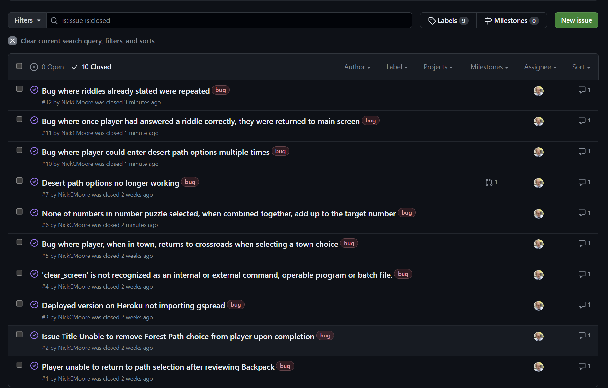

Examples of fixes created to address errors in validation can be seen below in examples of the commit history:

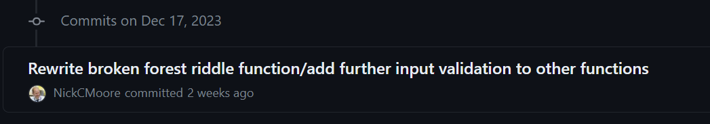

# Game Validation Testing

My testing strategy involved validating the core functionalities of the game, ensuring that different paths, encounters, and game mechanics worked as intended. The following areas were tested as a set of test cases:

- Game initialisation and setup
- Player input validation
- Path choices and progression
- Town encounters and events
- Desert path events and puzzles

## Test Cases

**1. Game Initialisation**

Scenario 1: Successful Initialisation

Test Steps:
- Run the game.
- Verify that the game initialises without errors.

Expected Outcome:
- The game starts without any errors.

Outcome:
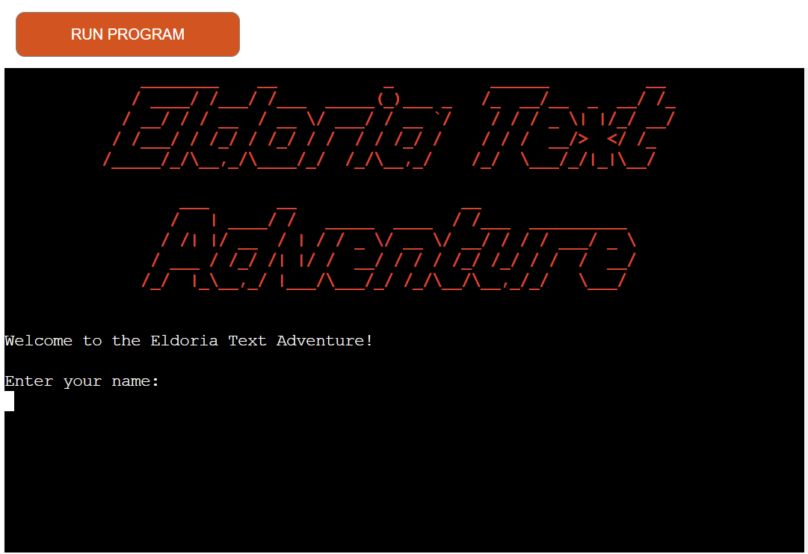

Result: Pass

**2. Player Input**

Scenario 1: Valid Player Name Input

Test Steps:
- During player initialisation, enter a valid player name.

Expected Outcome:
- The game proceeds without errors.

Outcome:
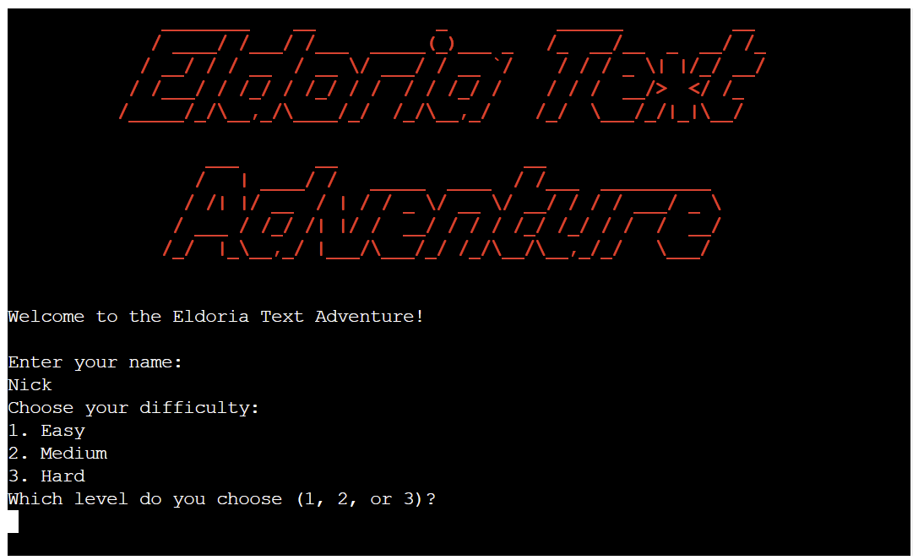

Result: Pass

Scenario 2: Invalid Player Name Input

Test Steps:
- During player initialisation, enter an invalid player name (e.g., numeric characters).

Expected Outcome:
- The game provides an error message and prompts for a valid name.

Outcome:
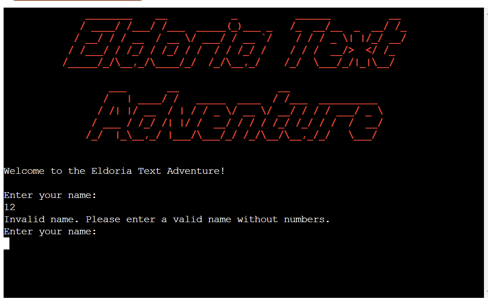

Result: Pass

Scenario 2: Invalid Difficulty Selection Input

Test Steps:
- During player initialisation, player enters invalid difficulty choice (e.g., a, b or c).

Expected Outcome:
- The game provides an error message and prompts for a valid number.

Outcome:
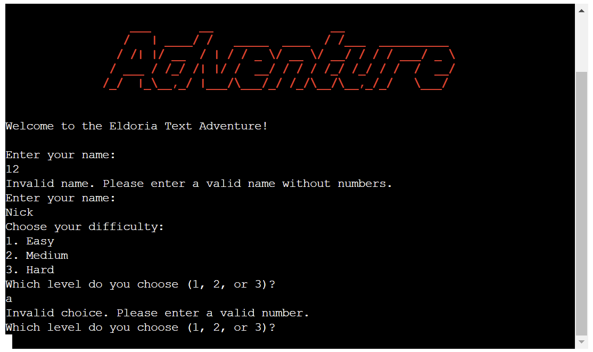

Result: Pass

**3. Crossroads Choices**

Scenario 1: Crossroads

Test Steps:
- Choose the Forest Path.

Expected Outcome:
- The Forest Path events and puzzles are triggered without errors.

Outcome:
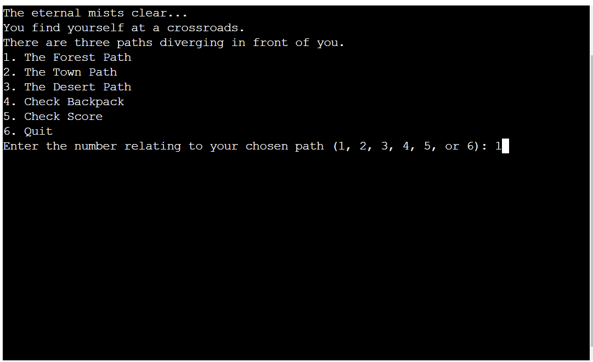
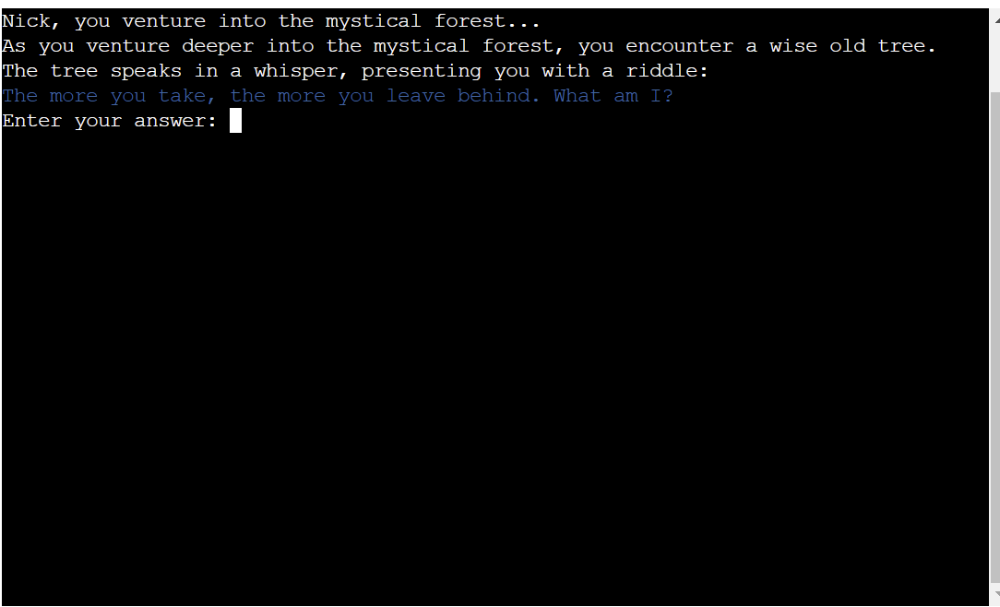

Result: Pass

Scenario 2: Town Path

Test Steps:
- Choose the Town Path.

Expected Outcome:
- Town events and encounters proceed without errors.

Outcome:

Result: Pass

**4. Town Encounters**

Scenario 1: Potion Shop Visit

Test Steps:
- Visit the Potion Shop in town.

Expected Outcome:
- Player gains health, and the potion shop events complete without errors.

Outcome:
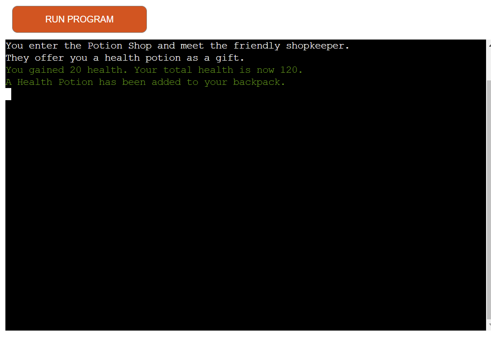

Result: Pass

Scenario 2: Market Square Exploration

Test Steps:
Explore the Market Square in town.

Expected Outcome:
- Market Square events and encounters proceed without errors.

Outcome:
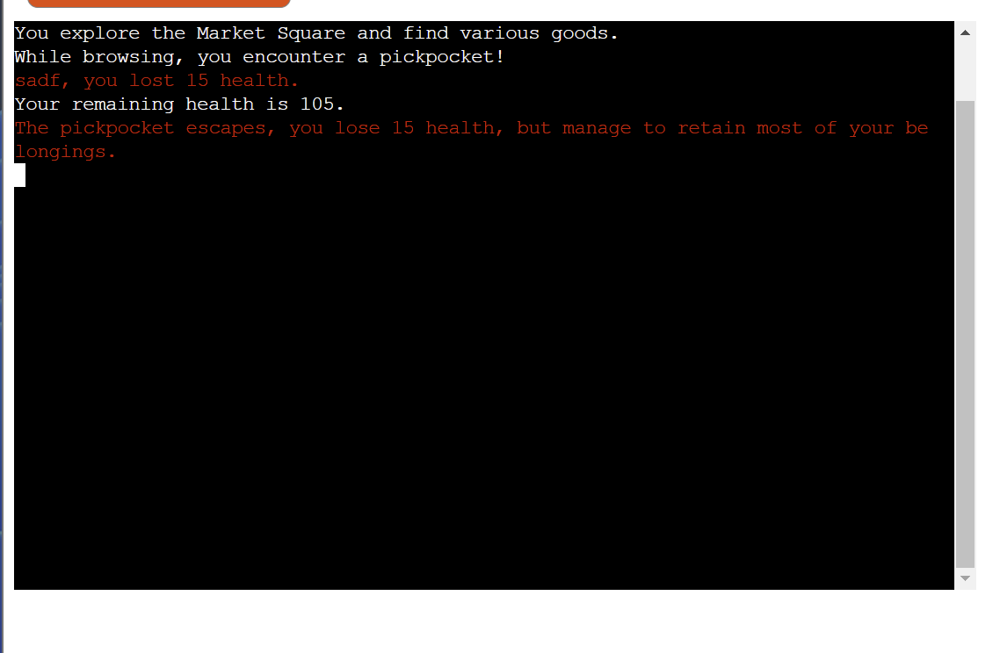

Result: Pass

**5. Desert Path**

Scenario 1: Search for Oasis

Test Steps:
- Choose to search for an oasis in the desert.

Expected Outcome:
- Oasis events and outcomes proceed without errors.

Outcome:
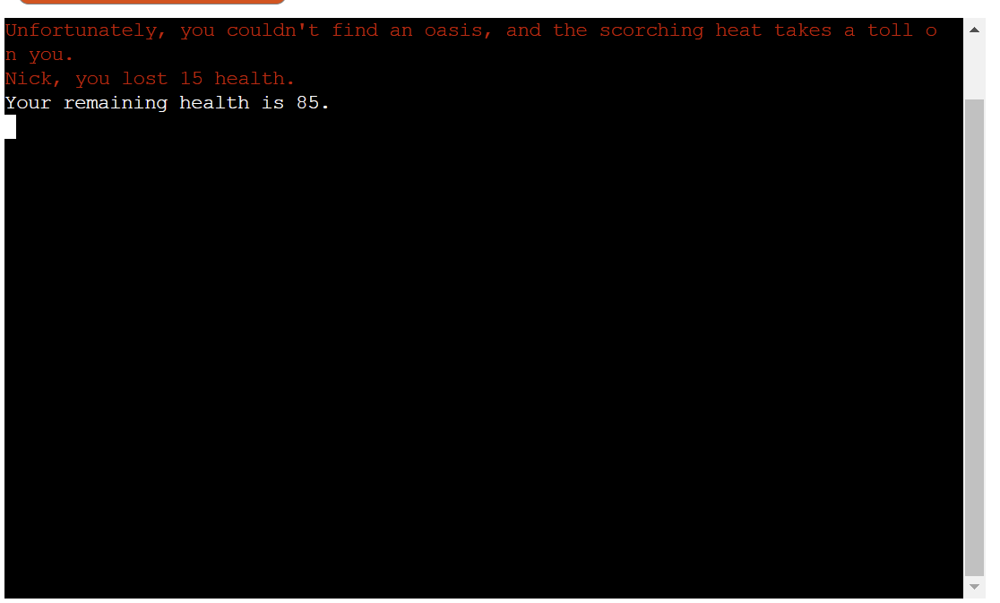

Result: Pass

Scenario 2: Navigate Sand Dunes

Test Steps:
- Choose to navigate the sand dunes in the desert.

Expected Outcome:
- Sand dunes events and puzzles proceed without errors.

Outcome:
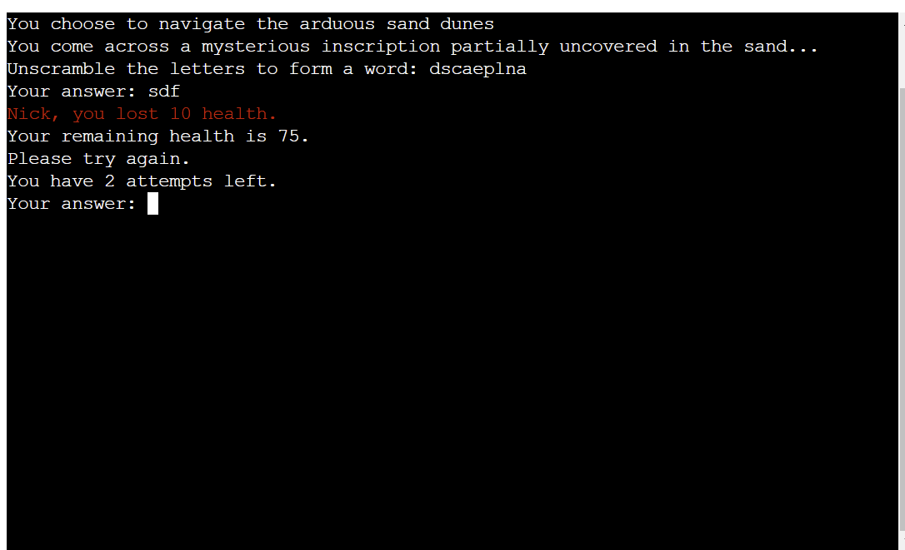

    Result: Pass

# Browser Testing

Upon deploying the application on Heroku, I thoroughly tested it on Chrome, Brave, and Edge. The program seamlessly loaded without any issues and functioned as expected across all browsers.

**Chrome**

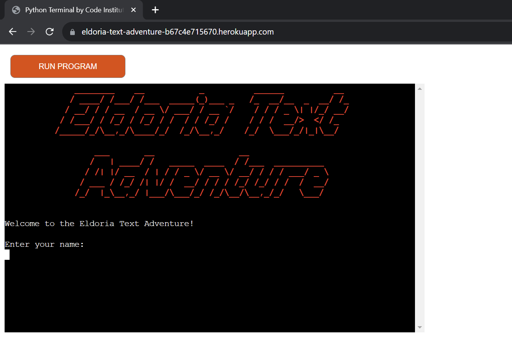

**Brave**

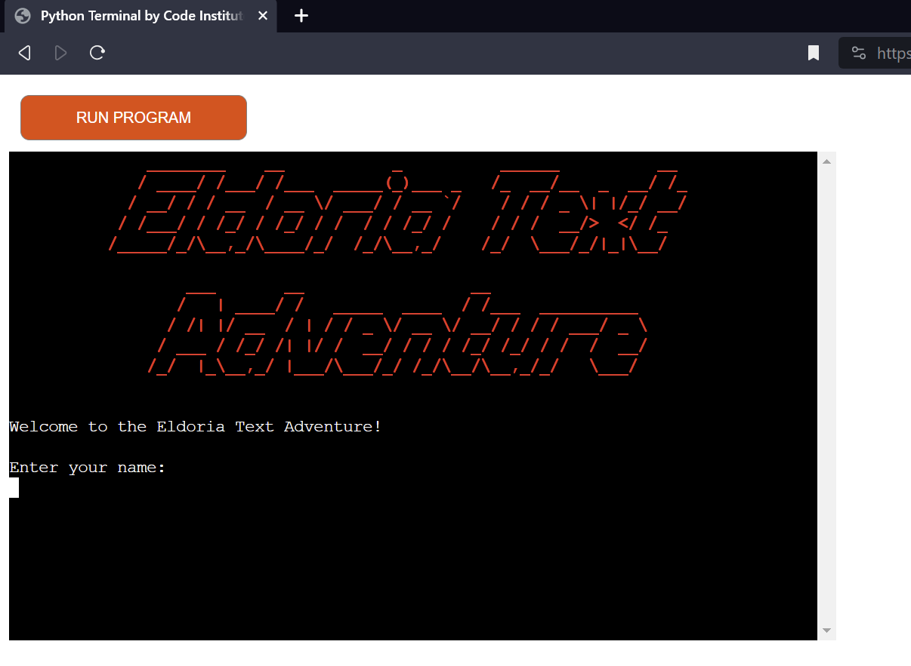

**Edge**

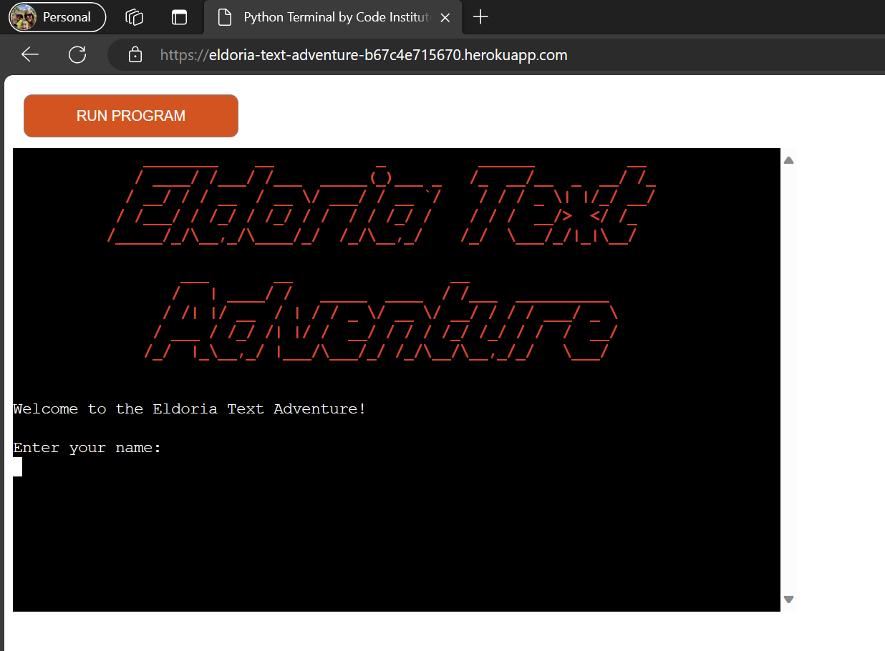

# Conclusion

The testing process aimed to cover all critical aspects of the game, ensuring stability and functionality in areas such as game initialisation, player input, and various in-game scenarios. Browser testing further confirmed cross-browser compatibility. This process helped to ensure the reliability of the current version of the game but also established a foundation for potential future iterations and enhancements of the game.